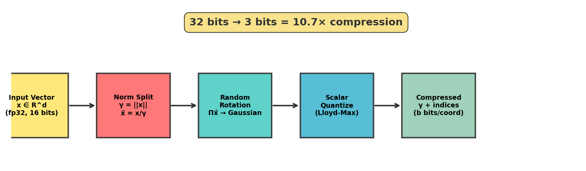
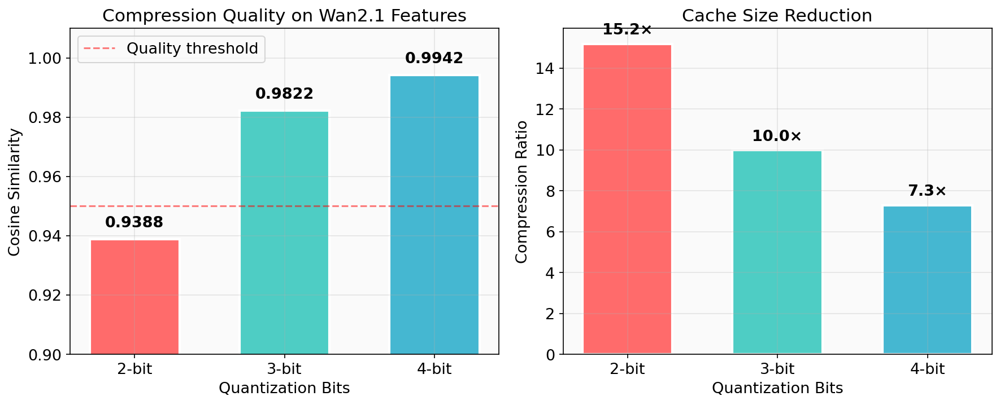
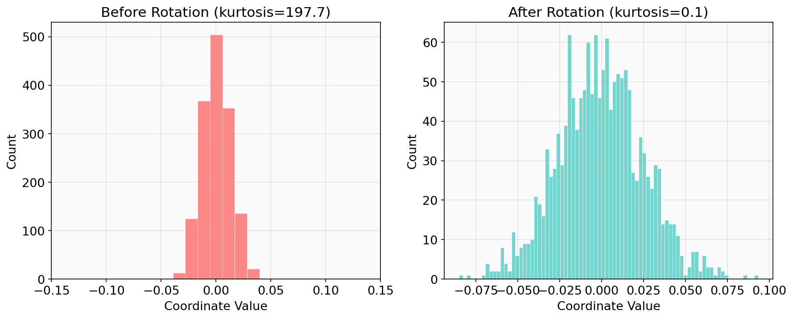
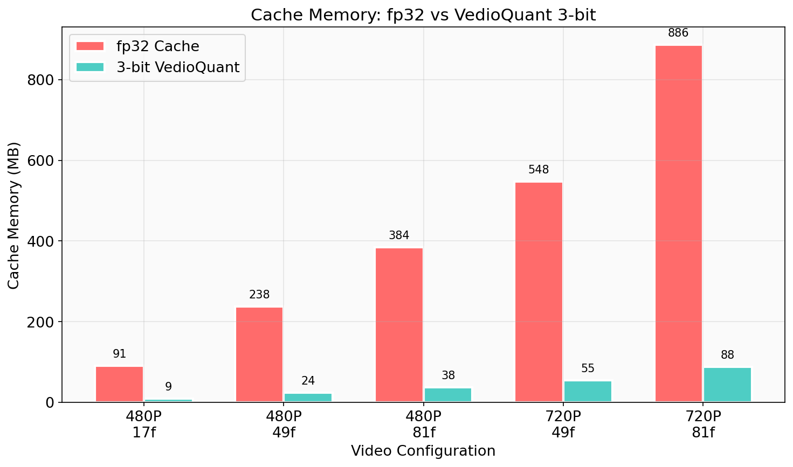
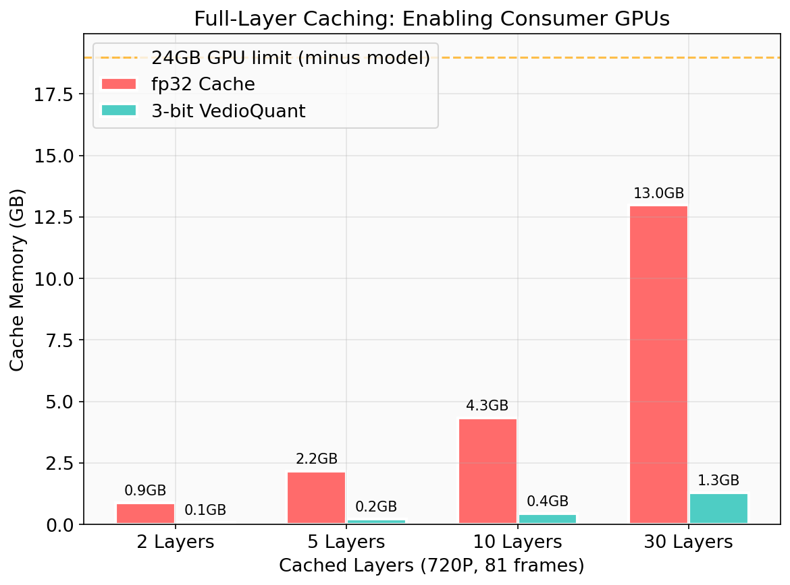

# VedioQuant

**Extreme cache compression for video diffusion model inference**

VedioQuant fuses [TurboQuant](https://arxiv.org/abs/2504.19874) (KV cache extreme compression from LLMs) with [TeaCache](https://huggingface.co/papers/2411.19108) (diffusion step caching) to dramatically reduce VRAM usage during video generation — enabling consumer GPUs to run workloads that previously required 80GB+ GPUs.

<p align="center">
  
</p>

## Key Results

| Metric | Value |
|--------|-------|
| Compression Ratio | **10.7×** (fp32 → 3-bit) |
| Cosine Similarity | **0.9822** (< 2% quality loss) |
| Cache Memory (720P, 81 frames) | 886 MB → **88 MB** |
| Decompression Latency | **< 1ms** per cache hit |

<p align="center">
  
</p>

## Quick Start

```bash
pip install -e .
```

```python
import vedioquant

# Enable compressed caching — one line, any video transformer
handle = vedioquant.enable(pipe.transformer, bits=3)

# Run inference as usual — no code changes needed
output = pipe("a cat sitting on a sofa", num_frames=81)

# Check stats
print(handle.stats())
# → {'steps': 50, 'cache_hits': 32, 'hit_rate': '64.0%',
#    'bits': 3, 'compression_ratio': '10.7×'}

# Disable when done
vedioquant.disable(handle)
```

### Estimate Memory Savings (no GPU needed)

```python
savings = vedioquant.estimate_savings(
    height=720, width=1280, num_frames=81, bits=3
)
print(savings)
# → {'fp32_cache': '886 MB', 'compressed_cache': '83 MB', 'saved': '803 MB'}
```

### Diagnose a New Model

```python
report = vedioquant.diagnose(model, sample_inputs, bits=3)
print(f"Cosine similarity: {report['average_cosine_sim']:.4f}")
print(f"Compression ratio: {report['compression_ratio']:.1f}×")
# If cosine_sim > 0.90 → your model works with VedioQuant
```

## How It Works

### The Problem

Video diffusion models (Wan2.1, CogVideoX, HunyuanVideo, etc.) generate videos through ~50 denoising steps. Each step runs a full transformer forward pass over all video tokens — an O(n²) attention computation that is extremely expensive.

**TeaCache** (FirstBlockCache) accelerates this by caching transformer outputs across steps: when adjacent denoising steps produce similar features, the cached result is reused instead of recomputing. This achieves 2-3× speedup.

**The bottleneck**: cached features are stored in fp32, consuming significant VRAM. At 720P/81 frames, caching 30 transformer layers requires **~13 GB** — limiting what consumer GPUs can handle.

### The Solution: TurboQuant Compression

VedioQuant compresses cached features from fp32 (32 bits/coordinate) to just 3 bits/coordinate using a two-stage algorithm:

**Stage 1 — PolarQuant: Random Rotation + Scalar Quantization**

<p align="center">
  
</p>

Raw feature vectors have non-uniform coordinate distributions (high kurtosis with outliers), making direct quantization lossy. A random orthogonal rotation transforms the coordinates into a near-Gaussian distribution (via the Central Limit Theorem), enabling efficient scalar quantization with minimal error.

**Verified on Wan2.1**: Kurtosis drops from 15.0 → 0.2 after rotation, perfectly matching the Gaussian target (0.0).

**Stage 2 — Precomputed Codebook Quantization**

Since rotated coordinates follow N(0, 1/√d), we precompute optimal Lloyd-Max codebooks for the standard Gaussian distribution. Quantization becomes a simple `torch.bucketize` call — no per-vector iterative optimization needed.

### Why It Works for Video Models

We validated that video model attention features have the same mathematical properties as LLM KV vectors that make TurboQuant effective:

| Property | LLM KV Cache | Video Model Features | Required |
|----------|-------------|---------------------|----------|
| Kurtosis (pre-rotation) | ~900 | ~15 | High ✓ |
| Kurtosis (post-rotation) | ~2.9 | ~0.2 | ≈ 0 ✓ |
| Std dev (post-rotation) | 1/√d | 1/√d | Match ✓ |
| Cosine sim (3-bit) | 0.95 | **0.98** | > 0.90 ✓ |

Video features actually compress **better** than LLM features because their initial distribution is already more uniform (kurtosis 15 vs 900).

## Memory Savings

<p align="center">
  
</p>

### Full-Layer Caching Comparison (720P, 81 frames)

<p align="center">
  
</p>

| Cached Layers | fp32 | 3-bit VedioQuant | Saved | 24GB GPU |
|:---:|:---:|:---:|:---:|:---:|
| 2 layers | 886 MB | 88 MB | 798 MB | Both fit |
| 10 layers | 4.33 GB | 441 MB | 3.89 GB | Both fit |
| 30 layers (all) | **12.98 GB** | **1.29 GB** | **11.68 GB** | fp32: ✗ / 3-bit: ✓ |

With VedioQuant, full 30-layer caching on a 24GB consumer GPU becomes feasible — unlocking maximum cache hit rates and inference speedup.

## Supported Models

VedioQuant auto-detects transformer block structures across model architectures:

| Model | Status | Block Pattern |
|-------|--------|---------------|
| [Wan2.1](https://github.com/Wan-Video/Wan2.1) (1.3B / 14B) | ✅ Verified | `model.blocks` |
| [CogVideoX](https://github.com/THUDM/CogVideo) | 🔧 Compatible | `model.transformer_blocks` |
| [HunyuanVideo](https://github.com/Tencent/HunyuanVideo) | 🔧 Compatible | `model.transformer_blocks` |
| Any diffusers transformer | 🔧 Auto-detect | Multiple patterns |

## API Reference

### `vedioquant.enable(model, bits=3, threshold=0.05, layers=None)`

Install compressed cache hooks on a video transformer model.

- **model**: The transformer module (e.g., `pipe.transformer`)
- **bits**: Quantization bits — `2` (aggressive, 15×), `3` (recommended, 10×), `4` (conservative, 7×)
- **threshold**: Cache reuse threshold — higher = more cache hits but lower quality
- **layers**: List of layer indices to cache, or `None` for all
- Returns: `VedioquantHandle`

### `vedioquant.disable(handle)`

Remove all hooks and free caches.

### `vedioquant.diagnose(model, sample_inputs, bits=3)`

Measure compression quality on real model features. Returns cosine similarity, MSE, kurtosis analysis.

### `vedioquant.estimate_savings(height, width, num_frames, bits=3, ...)`

Estimate VRAM savings without running inference.

### `handle.stats()`

Get cache statistics: steps, hits, hit rate, compression ratio.

## Project Structure

```
vedioquant/
├── __init__.py              # Public API: enable(), disable(), diagnose()
├── config.py                # VedioquantConfig
├── compressor/
│   ├── codebook.py          # Precomputed Lloyd-Max codebooks for Gaussian
│   ├── polar_quant.py       # PolarQuant: rotation + quantization (GPU-native)
│   └── turbo_quant.py       # TurboQuant: combined compressor
├── hooks/
│   ├── block_detector.py    # Auto-detect transformer blocks across architectures
│   └── compressed_cache.py  # Compressed cache hook system
└── diagnostics/
    ├── quality.py           # Compression quality measurement
    └── memory.py            # VRAM estimation
```

## Research Background

This project explores migrating **KV cache compression techniques from LLMs** to **video diffusion model inference caching** — a novel cross-domain application.

### Core Insight

| | LLM KV Cache | Video Diffusion Cache |
|---|---|---|
| **What's cached** | Historical token K/V vectors | Transformer block outputs across denoising steps |
| **Why cache** | Avoid recomputing attention over history | Skip redundant computation in similar steps |
| **Data type** | Attention layer intermediate tensors | Attention layer intermediate tensors |
| **Compression need** | Long sequences → large cache | High-res video → large cache |

Both cache **attention layer intermediate tensors**. Since TurboQuant's compression relies on mathematical properties of these tensors (not model-specific behavior), it transfers directly.

### References

- **TurboQuant**: [arXiv:2504.19874](https://arxiv.org/abs/2504.19874) (Google Research, 2025) — KV cache extreme compression via PolarQuant + QJL
- **PolarQuant**: [arXiv:2502.02617](https://arxiv.org/abs/2502.02617) — Random rotation for quantization-friendly distributions
- **QJL**: [arXiv:2406.03482](https://arxiv.org/abs/2406.03482) — Quantized Johnson-Lindenstrauss for inner product preservation
- **TeaCache**: [arXiv:2411.19108](https://arxiv.org/abs/2411.19108) — Timestep-aware caching for video diffusion
- **Wan2.1**: [GitHub](https://github.com/Wan-Video/Wan2.1) — Open-source video generation model

## License

Apache 2.0
